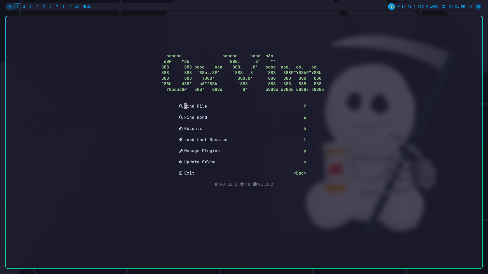
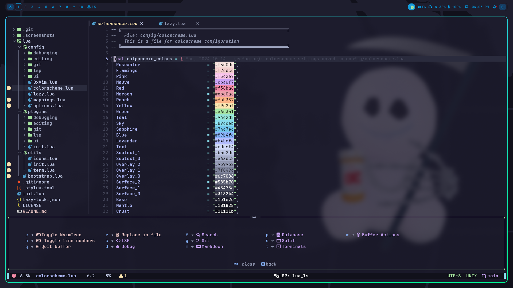

# 0xVim: C/C++ NeoVim config


## Features

- **Modern UI**: Uses `catppuccin` for a visually appealing theme.
- **Auto Completion**: Integrated with `nvim-cmp` and LSP.
- **LSP Support**: Managed by `nvim-lspconfig` and `mason.nvim`.
- **Enhanced UI**: Includes status line, bufferline, and file explorer.
- **Markdown Support**: Preview and formatting with `markdown-preview.nvim`.
- **Extensive Keybindings**: `which-key.nvim` helps visualize and navigate keybindings.

## Screenshots



Dashboard



Overview

## Installation

### Prerequisites
- Neovim 0.8+
- `git` installed on your machine

### Steps
1. Clone this repository into your Neovim configuration directory:
   ```bash
   git clone https://github.com/your-username/0xVim ~/.config/nvim
   ```
2. Start Neovim:
   ```bash
   nvim
   ```

## Features

- **Modern UI**: Uses `catppuccin` for a visually appealing theme.
- **Auto Completion**: Integrated with `nvim-cmp` and LSP.
- **LSP Support**: Managed by `nvim-lspconfig` and `mason.nvim`.
- **Enhanced UI**: Includes status line, bufferline, and file explorer.
- **Markdown Support**: Preview and formatting with `markdown-preview.nvim`.
- **Extensive Keybindings**: `which-key.nvim` helps visualize and navigate keybindings.

## Contributing

Feel free to submit pull requests or issues for improvements or bug fixes.

